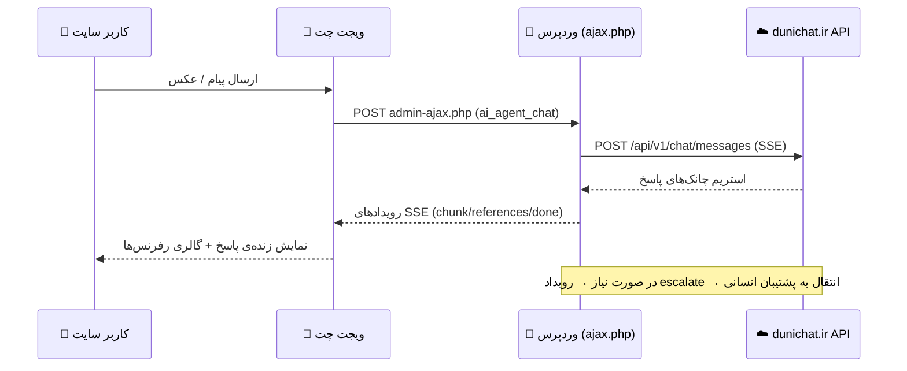

<div align="center">

# 🤖 دانیچَت | AI Agent for WordPress

**دستیار هوشمند فروشگاهی و پشتیبانی آنلاین، مبتنی بر هوش مصنوعی، برای وردپرس و ووکامرس**

[](https://wordpress.org)
[](https://www.php.net)
[](https://woocommerce.com)
[](LICENSE)

[معرفی](#-معرفی) •
[امکانات](#-امکانات) •
[نصب](#-نصب-و-راه‌اندازی) •
[معماری](#-معماری-پروژه) •
[پیکربندی](#️-پیکربندی)

<br>


</div>

---

## 📖 معرفی

**دانیچَت (Dunichat AI Agent)** یک افزونه‌ی وردپرسی است که یک **دستیار چت هوشمند** به سایت شما اضافه می‌کند. این ویجت با استفاده از هوش مصنوعی، به سؤالات بازدیدکنندگان بر اساس **محتوای واقعی سایت شما** (نوشته‌ها، برگه‌ها، محصولات و دسته‌بندی‌های ووکامرس) پاسخ می‌دهد و در صورت نیاز، گفتگو را به‌صورت خودکار به **پشتیبان انسانی** منتقل می‌کند.

تمام پردازش هوش مصنوعی از طریق سرویس اختصاصی [`dunichat.ir`](https://dunichat.ir) انجام می‌شود؛ این افزونه صرفاً یک رابط کاربری امن و کامل بین وردپرس شما و آن سرویس فراهم می‌کند.

---

## ✨ امکانات

<table>
<tr>
<td width="50%" valign="top">

### 💬 ویجت چت هوشمند
- پاسخ‌دهی **استریم زنده** (SSE) شبیه ChatGPT
- پشتیبانی از ارسال **تا ۴ عکس** در هر پیام
- حالت **دارک / لایت مود** با یادآوری انتخاب کاربر
- گالری تصویری محصولات مرتبط با پاسخ مدل
- ذخیره و بازیابی خودکار تاریخچه‌ی گفتگو

### 🔄 همگام‌سازی محتوا (Sync)
- سینک **افزایشی** (فقط محتوای جدید/حذف‌شده)
- سینک **کامل** (ارسال تمام محتوا از ابتدا)
- ارسال دسته‌ای (Batch) برای جلوگیری از Timeout
- پیگیری وضعیت پردازش هر آیتم (queued/processing/…)
- نمودار زنده‌ی وضعیت ارسال‌ها (Chart.js)

</td>
<td width="50%" valign="top">

### 🎧 انتقال به پشتیبان انسانی
- تشخیص خودکار نیاز به Escalation توسط مدل
- پنل مدیریت ‌سشن‌ها با فیلتر وضعیت
- ارسال پاسخ دستی و بستن گفتگو از پیشخوان وردپرس

### 🔐 امنیت و تنظیمات
- رمزنگاری **AES-256-CBC** برای ذخیره‌ی API Key
- کلید رمزنگاری مشتق‌شده از `AUTH_KEY` هر نصب وردپرس
- انتخاب مدل هوش مصنوعی با جستجوی زنده
- تنظیم پرامت سیستم، رنگ ویجت، Timeout و توکن‌ها
- محدودیت‌ها و سهمیه‌ی روزانه از سرور همگام‌سازی

</td>
</tr>
</table>

---

## 🚀 نصب و راه‌اندازی

### پیش‌نیازها

| نیازمندی | نسخه |
|---|---|
| وردپرس | `5.8+` |
| PHP | `7.4+` (با فعال بودن `curl` و `openssl`) |
| ووکامرس *(اختیاری)* | برای سینک محصولات و دسته‌بندی‌ها |

### مراحل نصب

```bash
# ۱) کلون یا دانلود مخزن
git clone https://github.com/ManiKamyabi/Hamgoftar-Plugin.git

# ۲) انتقال به پوشه‌ی پلاگین‌های وردپرس
mv Hamgoftar-Plugin /path/to/wordpress/wp-content/plugins/
```

سپس:

1. از پیشخوان وردپرس وارد بخش **افزونه‌ها ← افزونه جدید ← بارگذاری** شوید یا افزونه را از حالت غیرفعال، **فعال** کنید.
2. به منوی **«دانیچَت»** در سایدبار پیشخوان بروید.
3. **کلید API** دریافتی از [dunichat.ir](https://dunichat.ir) را وارد و ذخیره کنید.
4. مدل هوش مصنوعی، پرامت سیستم و منابع محتوا (نوشته/برگه/محصول/دسته‌بندی) را انتخاب کنید.
5. روی **«همگام‌سازی اطلاعات»** کلیک کنید تا محتوای سایت به مدل آموزش داده شود. 🎉

---

## ⚙️ پیکربندی

می‌توانید مقادیر پیش‌فرض را با تعریف ثابت‌های زیر در `wp-config.php` تغییر دهید:

```php
// حداکثر تعداد عکس مجاز در هر پیام چت (پیش‌فرض: ۴)
define('AI_AGENT_MAX_CHAT_IMAGES', 4);
```

کلید API به‌صورت رمزشده (AES-256-CBC) در `wp_options` ذخیره می‌شود و کلید رمزنگاری به‌طور خودکار از ثابت `AUTH_KEY` وردپرس مشتق می‌گردد — بنابراین نیازی به تنظیم دستی هیچ secret جداگانه‌ای نیست.

---

## 🏗️ معماری پروژه

```
dunichat-ai-agent/
│
├── 🗄️  db.php            # جداول دیتابیس، رمزنگاری API Key، مدیریت آیتم‌های سینک‌شده
├── ⚙️  settings.php       # صفحه‌ی تنظیمات، sanitize، همگام‌سازی تنظیمات با سرور
├── 🌐 api.php             # تمام تماس‌های HTTP/cURL به سرویس dunichat.ir (chat/sync/history)
├── 🧩 widget.php          # رندر HTML ویجت چت شناور در فوتر سایت
├── 🔁 ajax.php            # هندلرهای AJAX (چت SSE، تاریخچه، ‌سشن‌ها، پاسخ پشتیبان)
├── 🔄 sync.php            # منطق جمع‌آوری و ارسال محتوای وردپرس/ووکامرس
├── 📦 enqueue.php         # بارگذاری استایل/اسکریپت فرانت‌اند و localize کردن تنظیمات
│
├── assets/
│   ├── js/
│   │   ├── ai-agent.js        # منطق فرانت‌اند ویجت چت (استریم، عکس، لایت‌باکس)
│   │   └── settings.js        # منطق پنل تنظیمات (مدل‌ها، سینک، نمودار، تاریخچه)
│   └── css/
│       ├── ai-agent.css       # استایل ویجت چت
│       └── SettingsStyles.css # استایل پنل تنظیمات پیشخوان
│
└── README.md
```

### 🔗 جریان داده (Data Flow)



---

## 🛠️ اندپوینت‌های سرویس ابری

| اندپوینت | کاربرد |
|---|---|
| `POST /api/v1/chat/messages` | ارسال پیام و دریافت پاسخ استریم (SSE) |
| `GET  /api/v1/sync/settings` | دریافت مدل، پرامت سیستم و منابع مجاز |
| `PATCH /api/v1/sync/settings` | ارسال تنظیمات جدید کاربر |
| `POST /api/v1/sync/content` | ارسال محتوای سایت جهت آموزش مدل |
| `POST /api/v1/sync/delete` | اطلاع‌رسانی حذف محتوا |
| `POST /api/v1/sync/content/status/batch` | استعلام وضعیت پردازش دسته‌ای |
| `GET  /api/v1/chat/sessions` | لیست ‌سشن‌ها چت |
| `POST /api/v1/chat/sessions/{id}/reply` | پاسخ دستی پشتیبان |
| `POST /api/v1/chat/sessions/{id}/close` | پایان دادن به سشن |

---

## 🤝 مشارکت

خوشحال می‌شویم مشارکت شما را در بهبود این پروژه ببینیم:

1. مخزن را **Fork** کنید.
2. یک شاخه‌ی جدید بسازید: `git checkout -b feature/امکان-جدید`
3. تغییرات را کامیت کنید: `git commit -m 'افزودن امکان جدید'`
4. شاخه را Push کنید: `git push origin feature/امکان-جدید`
5. یک **Pull Request** باز کنید.

---

## 📄 لایسنس

این پروژه تحت لایسنس **GPLv2 or later** منتشر شده است — همانند اکثر افزونه‌های وردپرس.

---

<div align="center">

ساخته‌شده با ❤️ برای جامعه‌ی فارسی‌زبان وردپرس

**[دانیچَت](https://dunichat.ir)** © تمامی حقوق محفوظ است.

</div>
